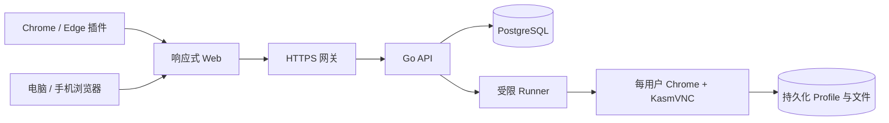

# Cloud Browser

把一台服务器变成属于账号的随身 Chrome。用户从电脑、平板或手机登录网页，就能继续使用同一份标签页、Cookie、收藏夹、历史记录、网站存储和文件；Chrome/Edge 插件可以把当前网址一键送到云端打开。


## 它能做什么

- 每个账号拥有独立的真实 Chrome 容器和持久化 Profile。
- 网页内提供画面、鼠标键盘、中文输入、文本剪贴板、声音、上传与下载。
- 新设备可以主动接管控制权，旧设备立即失去输入和画面连接。
- 所有设备断开 10 分钟后自动关闭 Chrome，下次访问恢复浏览数据。
- 管理员可邀请或禁用用户、查看资源、停止异常会话；每位用户都能自行修改密码。
- 浏览器以非 root 身份运行，保持 Chrome 沙箱，禁止访问宿主控制面、私网和云元数据地址。

产品定位是个人与少量受邀用户的单机版本，默认最多 3 个同时运行的浏览器。4 GB 内存服务器建议设为 1 个会话，3 个会话建议至少 4 核、8 GB 内存和 SSD。

## 首次安装

准备一台带公网 IP 的 x86_64 Debian/Ubuntu 服务器，并把域名 A 记录指向该服务器。随后只需执行：

```bash
git clone git@github.com:liyongliao/Cloud-Browser.git
cd Cloud-Browser
sudo ./scripts/install.sh
```

脚本会自动安装 Docker、Compose 与隔离依赖，随后输出一次性安装链接。打开链接后，通过网页完成域名、HTTPS、数据库、管理员账号和并发容量设置。


向导会在开始前汇总配置。管理员密码只用于创建账号，不写入 `.env` 或安装日志；初始化完成后入口失效。


完整图文步骤、已有 Nginx 的接入方式和故障处理见 [首次安装教程](docs/installation-guide.md)。

## 日常使用

登录后从“我的浏览器”启动或接管云端 Chrome；“我的文件”负责本地与云端文件往返；“账号设置”可以修改自己的密码，保存后其他设备需要重新登录。


详细操作见 [使用教程](docs/user-guide.md)，部署、备份、恢复和升级见 [部署与运维](docs/deployment.md)。

## 技术结构



| 模块                                 | 实现                                                    |
| ------------------------------------ | ------------------------------------------------------- |
| Web 与插件                           | React、TypeScript、Vite、Manifest V3                    |
| API、Runner、Browser Agent、安装向导 | Go                                                      |
| 数据库                               | PostgreSQL 17 或外部 PostgreSQL                         |
| 浏览器                               | Ubuntu 24.04、Google Chrome Stable、KasmVNC、PulseAudio |
| 网关与部署                           | Caddy、Docker Compose；可接入现有 Nginx                 |

接口契约位于 [api/openapi.yaml](api/openapi.yaml)，安全与会话边界见 [架构说明](docs/architecture.md)，当前验证范围见 [验收记录](docs/verification.md)。

## 本地开发

需要 Go 1.25.14+、Node 22.18+、npm 和 Docker：

```bash
npm ci
npm run build
npm test
go test -race ./...
go vet ./...
./scripts/test-integration.sh
```

运行控制面预览：

```bash
./scripts/dev.sh
```

打开 `http://127.0.0.1:5188`，临时账号为 `preview@example.test`，密码为 `local-preview-password`。预览使用真实 API 和临时数据库，但不会模拟远程 Chrome。

构建可加载的 Chrome/Edge 扩展：

```bash
./scripts/package.sh
```

第三方组件与许可证来源见 [THIRD_PARTY_NOTICES.md](THIRD_PARTY_NOTICES.md)。
