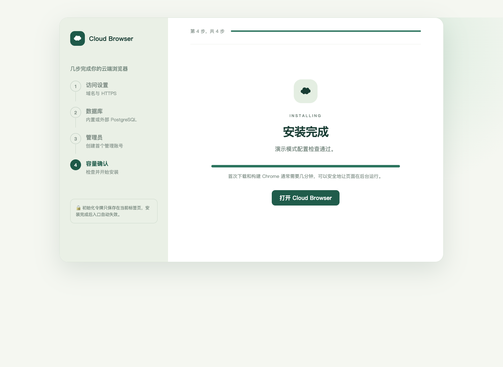

# 首次安装教程

这套流程面向第一次部署 Cloud Browser 的管理员。终端只负责准备系统和启动一次性安装页，日常配置在网页完成。

## 1. 准备服务器与域名

服务器需要满足：

- x86_64 Debian 12/13 或 Ubuntu 22.04/24.04。
- root 或 sudo 权限，内核启用用户命名空间和 AppArmor。
- 至少 2 核、4 GB 内存、25 GB 可用 SSD；4 GB 内存请选择 1 个并发会话。
- 新服务器开放 TCP 22、80、443。安装向导临时使用 8090，不能开放时使用 SSH 隧道。

在 DNS 服务商添加 A 记录，例如 `browser.example.com → 服务器公网 IPv4`。等待下面命令返回正确地址：

```bash
getent ahostsv4 browser.example.com
```

## 2. 运行一条安装命令

```bash
git clone git@github.com:liyongliao/Cloud-Browser.git
cd Cloud-Browser
sudo ./scripts/install.sh
```

脚本会完成以下工作：安装并启动 Docker、加载 Chrome 沙箱配置、创建专用出站网络与防火墙规则、构建安装向导。它不会创建默认账号或默认生产密码。

终端最后会显示带一次性令牌的 URL：

```text
http://服务器地址:8090/#token=一次性令牌
```

如果云防火墙没有开放 8090，在自己的电脑运行：

```bash
ssh -L 8090:127.0.0.1:8090 root@服务器地址
```

然后访问终端显示的本地链接。令牌位于 URL fragment，不会进入 HTTP 访问日志；页面读取后会立即清除地址栏中的令牌。

## 3. 完成网页向导

第一步填写最终访问域名。空白服务器选择“自动 HTTPS”，Caddy 会使用 80/443 自动申请证书。服务器已有 Nginx、Traefik 或其他网关时，选择“已有反向代理”；Cloud Browser 会仅监听 `127.0.0.1:18088`，随后按本页的反代示例接入。

第二步选择数据库：


- “内置 PostgreSQL”适合个人部署，数据库和浏览器数据一起保存在服务器。
- “外部 PostgreSQL”会在安装时验证主机、端口、库名、用户、密码和 SSL 模式。数据库必须是空库，首次安装不会覆盖已有用户数据。
- 数据库密码可由网页自动生成。出于 `.env` 解析安全，只接受字母、数字和 `. _ ~ ! % + -`，长度 12–128 位。

第三步创建第一个管理员。密码必须至少 12 个字符，使用 Argon2id 保存摘要，不会写入部署环境文件。

第四步设置 1–3 个并发会话并确认摘要：


点击“开始安装”后，页面会显示数据库连接、数据表初始化、Chrome 镜像构建和正式服务启动进度。首次下载通常需要数分钟，不要重复提交。



完成标记写入后，安装 API 永久拒绝重复初始化；临时安装容器会在 10 分钟后退出并自动删除。此时可以关闭 8090 的云防火墙规则。

## 4. 已有反向代理时接入

选择“已有反向代理”后，使用仓库中的 [Nginx 示例](../deploy/nginx.conf.example)，替换域名和证书路径：

```bash
sudo cp deploy/nginx.conf.example /etc/nginx/sites-available/cloud-browser.conf
sudo ln -s /etc/nginx/sites-available/cloud-browser.conf /etc/nginx/sites-enabled/cloud-browser.conf
sudo nginx -t
sudo systemctl reload nginx
```

反向代理必须保留 WebSocket Upgrade、关闭代理缓冲、允许 201 MB 请求体，并把外部协议传为 HTTPS。不要把 `127.0.0.1:18088` 暴露到公网。

## 5. 安装后检查

```bash
docker compose ps
curl -fsS https://你的域名/healthz
systemctl status cloud-browser-firewall
docker ps --filter label=cloud-browser.managed=true
```

登录后启动一次浏览器，确认能看到 Chrome、输入中文、播放一段带声音的视频，并完成一次上传和下载。详细清单见 [部署与运维](deployment.md)。

## 常见问题

“域名无法申请证书”：确认 DNS 已指向本机公网 IP，80/443 没有被其他程序占用，云防火墙允许访问。

“8090 打不开”：优先使用上面的 SSH 隧道，不需要长期开放安装端口。

“数据库连接失败”：外部数据库需要允许服务器 IP 访问，账号需要建表权限，防火墙需放行对应端口；`verify-full` 还要求证书主机名匹配。

“外部数据库如何备份”：项目自带的定时备份只处理内置 PostgreSQL。外部数据库应使用其云厂商快照或独立 `pg_dump` 策略；Profile 备份前仍需正常停止浏览器以取得一致数据。

“服务器只有 4 GB 内存”：选择 1 个会话。若同机还有其他服务，应增加内存或迁移服务。

“中途失败”：页面会显示具体阶段，可以修改配置后重试。若数据库已成功创建管理员，重试时必须使用同一个邮箱和密码，系统不会覆盖已有用户。
